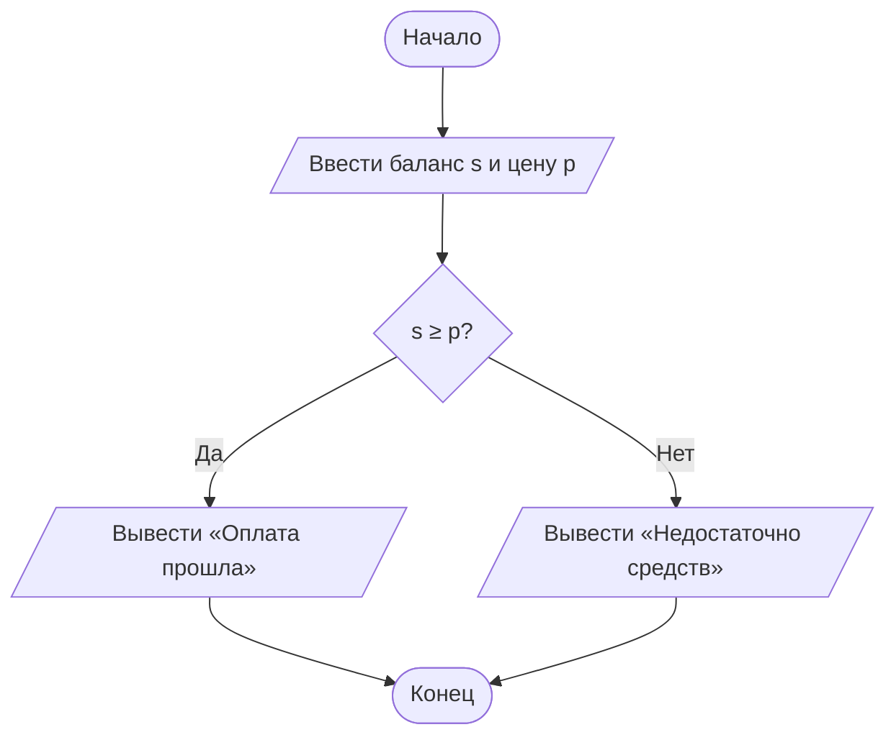

# Проверка оплаты

Алгоритм проверяет, хватает ли баланса на покупку.

```mermaid
flowchart TD
    A([Начало]) --> B[/"Ввести баланс s и цену p"/]
    B --> C{"s ≥ p?"}
    C -->|Да| D[/"Вывести «Оплата прошла»"/]
    C -->|Нет| E[/"Вывести «Недостаточно средств»"/]
    D --> F([Конец])
    E --> F
```